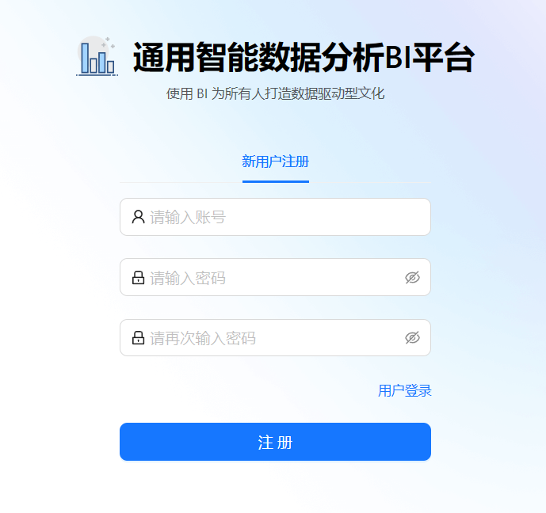
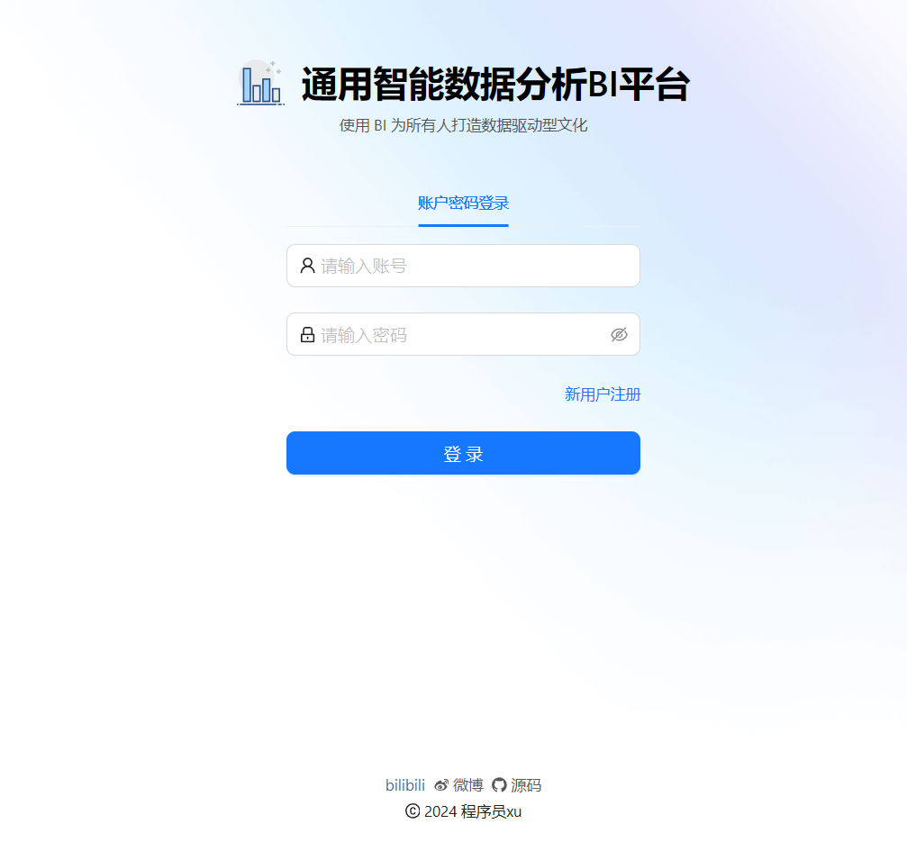
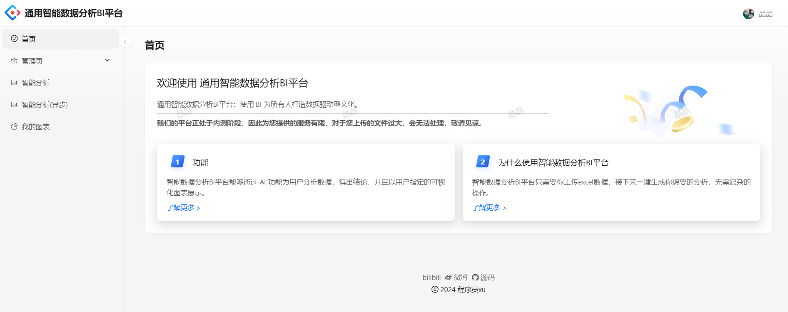
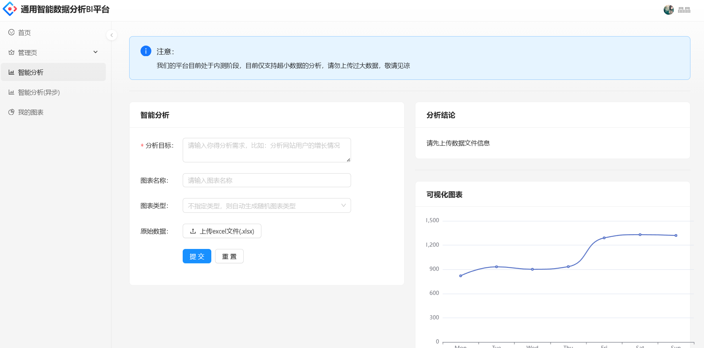
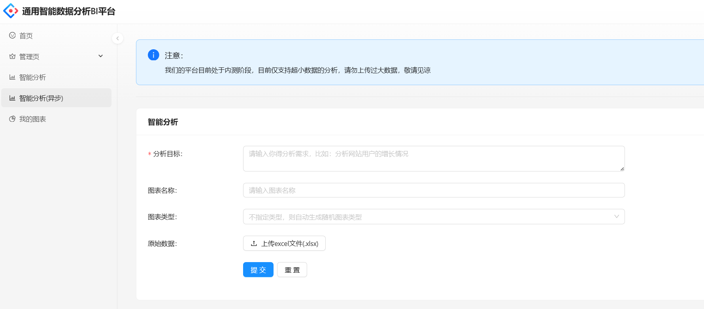
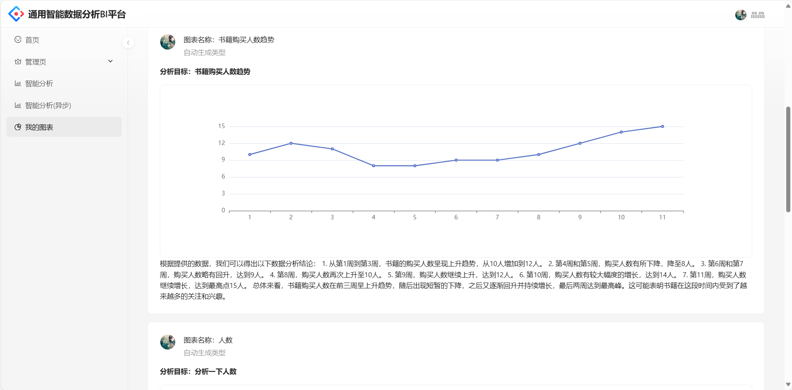

# 通用智能数据分析BI平台

> 作者：[程序员xu](https://github.com/jingxuyy)

基于 Java SpringBoot  Redis  MySQL RabbitMQ等技术栈 数据分析平台。

## 项目背景
1. 基于AI快速发展的时代，AI + 程序员 = 无限可能
2. 传统数据分析流程繁琐：传统的数据分析过程需要经历繁琐的数据处理和可视化操作，耗时且复杂
3. 技术要求高：传统数据分析需要数据分析者具备一定的技术和专业知识，限制了非专业人士的参与
4. AI自动生成图表和分析结论：该项目利用AI技术，只需导入原始数据和输入分析目标，即可自动生成符合要求的图表和分析结论
5. 提高效率降低成本：通过项目的应用，能够大幅降低人工数据分析成本，提高数据分析的效率和准确性

## 技术栈
### 前端
1. React 18
2. Umi 4 前端框架
3. Ant Design Pro 5.x 脚手架
4. Ant Design 组件库
5. OpenAPI 代码生成：自动生成后端调用代码
6. EChart 图表生成
### 后端
1. Spring Boot 2.7.2
2. MyBatis + MyBatis Plus 数据访问
3. Redis：Redisson限流控制
4. RabbitMQ：消息队列
5. 讯飞星火api：ai分析接口
6. JDK 线程池及异步化
7. Swagger + Knife4j 项目文档
8. MySQL 数据库
9. Redis 内存数据库
10. Easy Excel 表格处理

## 功能介绍

### 1. 主要功能

> 用户可以在线使用我们的数据分析平台，只需要告诉我们的系统您的分析目标，上传excel数据即可。
> 我们系统会在后台根据用户的输入进行智能分析，分析的结果以文字和可视化图表进行展示

### 2. 使用限制

- 首先用户需要登录才可使用此功能
- 目前我们的平台仅支持excel文件
- 由于大模型的限制和处于测试阶段，您上传的文件不能太大
- 我们平台会记录您每次分析的数据和图表，您可以进行查阅

### 3. 使用介绍

- 注册

- 登录

- 首页

- 智能分析页

- 异步智能分析页

- 我的图表

### 4. 解释说明
在智能分析页中，用户只需要输入分析目标，输入图表名称，图表类型(可以不输入，不输入默认大模型自动选择图表类型)，上传excel文件
之后点击提交后，需要等待1~2分钟，大模型输出会在分析结论处给出结论，可视化图表展示图表，另外如果用户需要查看之前的分析结果可以在我的
图表中进行查询

另外我们还提供了异步分析的接口，因为普通分析需要等待1\~2分钟，在此期间用户不能处理其它图表。如果您需要分析多个图表，
那么您可以使用异步分析，此功能只需要您输入分析目标和上传excel文件后，会将任务交给后台处理，不需要等待1\~2分钟，
再次您可以继续上传excel分析其它问题。并且您的分析结果会在我的图表中展示

